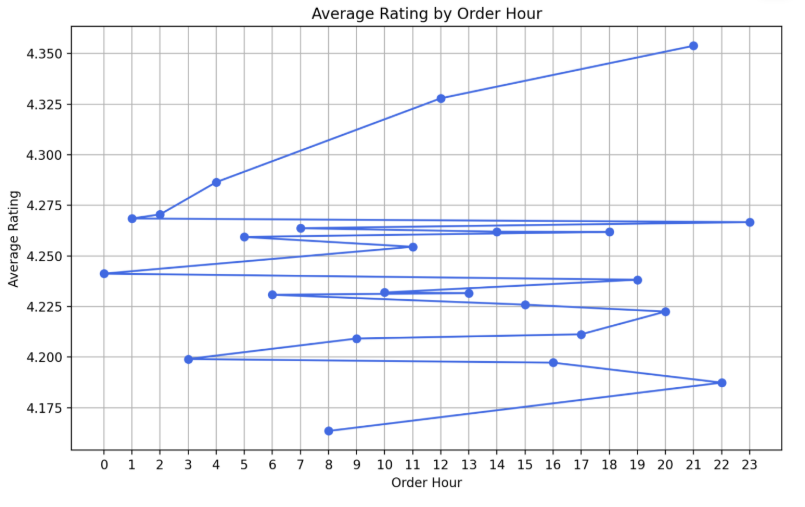
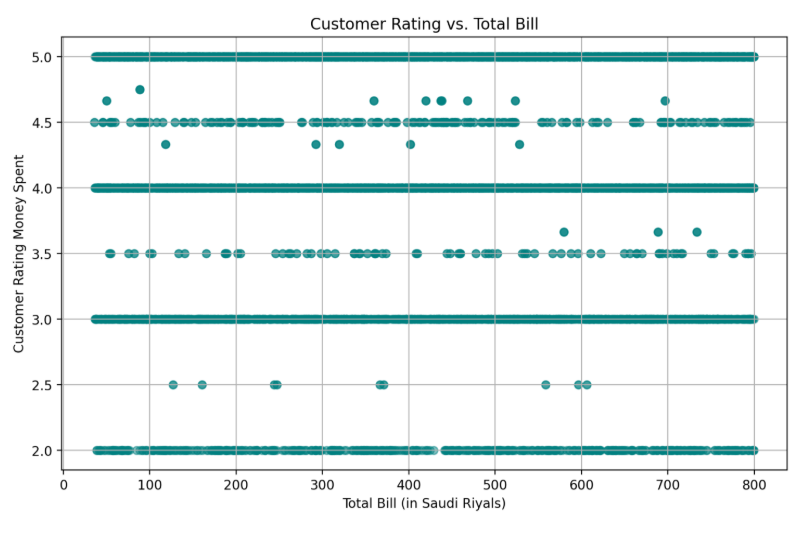

# Operational Analysis of Food Delivery in Saudi Arabia

## Project Overview
This project aims to provide actionable insights into the operational performance of a food delivery service in Saudi Arabia. The analysis focuses on understanding customer satisfaction, delivery times, and identifying potential areas for improvement in the delivery process. The results are presented in an interactive dashboard to facilitate decision-making for operations teams and business stakeholders.

## Purpose
The main goal is to answer key business questions that help optimize delivery operations and enhance customer experience. Although the dataset used is synthetic, the methodology and analytical approach are designed to be applicable to real-world scenarios.

## Data Availability
The dataset used in this project is synthetic and is included in the repository. It contains realistic food delivery records, but does not represent real customer information. The file size is small (486 KB), making it easy to download and reproduce the analysis. You can find the data in the `data/raw/` folder.

## Tools and Technologies
- **Pandas**: Data manipulation and aggregation
- **Matplotlib**: Data visualization
- **Streamlit**: Interactive dashboard development
- **Jupyter Notebook**: Exploratory data analysis and prototyping

## Key Business Questions Addressed
1. **At what specific minute do customers get angry about waiting for their food?**
2. **Which cities have the most problems?**
3. **Which restaurants have the most problems?**
4. **At what time are customers most likely to be less tolerant of longer delivery times?**
5. **Does the amount of money spent on the order influence customers' tolerance for long delivery waits?**

## Sample Results
Below are some sample charts generated during the analysis:


*Figure 1. Distribution of delivery times by hour. This graph shows the times when customers are least likely to wait longer to receive food delivery.*


*Figure 2. Distribution of customer ratings in relation to total bill. This chart shows if there is any relationship between customer rating and delivery cost*

## How to Use
- All data processing and analysis are performed in Jupyter Notebooks located in the `notebooks` folder.
- The final results and visualizations are available in the Streamlit dashboard (`dashboard/dashboard.py`).
- To run the dashboard, use the following command:
  ```bash
  streamlit run dashboard/dashboard.py
  ```

For any questions or feedback, feel free to contact me via GitHub.
